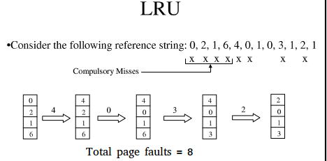

Least Recently Used
===========================================
操作系统使用分页机制来管理内存，最常见的页面置换算法就是LRU。

此外，缓存也可以用此算法来管理。

LRU缓存
------------------------------
使用两种数据结构来实现LRU缓存：

1. 队列。双向链表实现。链表的每个结点代表缓存中的一个页(page)，最大长度等于缓存的大小。
2. 哈希表。缓存中页的序号为key，相应的链表结点的地址为value。

当一个页(page)被引用时，如果它在内存中，就把相应的链表结点放到队列的头部，并返回数据。

如果它不在内存中，就将其读入内存，即在队列的头部增加一个链表结点，并在哈希表中更新相关的key和value信息。如果队列满了，我们从队尾去掉一个结点，把新的结点加到队首。

页面置换
------------------------------
http://www.geeksforgeeks.org/program-page-replacement-algorithms-set-1-lru/

使用分页机制管理内存的操作系统，需要页面置换算法来决定，哪些页面需要被替换。当一个不在内存中的新页面被引用时，硬件产生page fault异常，操作系统用新的页面替换现有页面。不同的页面置换算法的思路不同，但目标都是减少page fault的数量。

LRU的思路是，最近最少使用的页面，比较不可能被再次使用。

网页中给出的算法是：设置一个递增的index，每次引用页面(不管在不在内存中)，都会将页面的index更新，页面的index可以表明它们的使用次序，index最小的页面就是最近最少使用的页面；设置一个unordered_set，保存当前已加载的页面，可用于快速判断一个页面是否已加载到内存；设置一个unordered_map，key为页面的id，value为页面的index，要找到index最小的页面，需要遍历unordered_map。

上述算法并不很好，首先index一直递增，总会有上限，到时候还得特殊处理；其次，遍历unordered_map(哈希表)需要O(n)时间，这里用最小堆代替哈希表显然能获得更好的性能。
