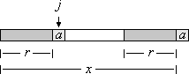

Knuth-Morris-Pratt algorithm(KMP)
==========================================
思路
----------------------------------
我们将pattern与string的匹配过程形象地写成将pattern与string对齐，然后进行比较::

    string:     ANPANMAN
    pattern:    PAN

暴力解法每轮对比后，只将pattern右移一位，即::

    string:     ANPANMAN
    pattern:     PAN

KMP算法对pattern进行预处理，用得到的信息，使pattern向右移动尽可能多的位置，提升算法性能。

定义
----------------------------------
设A为字符集，x为长度为k的字符串， 由以下字符组成x = x_0, x_1 ... x_k-1。

前缀(prefix)
    x的一个前缀为x的一个子字符串u = x_0, x_1, ... x_b-1，b属于[0, k]

后缀(suffix)
    x的一个后缀为x的一个子字符串u = x_k-b ... x_k-1，b属于[0, k]

适当前缀/后缀(proper prefix/suffix)
    长度不等于x的前缀/后缀，即u不能是x本身。

边界(border)
    既是x的适当前缀又是适当后缀的子字符串r为x的边界，即r = x_0 ... x_b-1且r = x_k-b ... x_k-1，b属于[0, k]。空字符串永远是x的一个边界。空字符串本身没有边界。

预处理
----------------------------------
定理：令r、s为字符串x的边界，长度r < s，那么，r是s的边界。如下图所示：

.. image:: images/border.gif

若s是x最宽的边界，那么x第二宽的边界r就是s的最宽边界。

定义：令字符串为x，令a为字符集中一个字符。如果ra是xa的一个边界，那么我们说x的边界r可以被字符a扩展。如下图所示：

在预处理阶段，需要计算一个长度为m + 1的数组b。b[i]表示x的长度为i的前缀的最宽边界的长度。因为空字符串没有边界，所以i = 0时，b[i] = -1

.. image:: images/rand4.gif

在b[0], ..., b[i]已知的情况下，b[i+1]可用如下方法计算出来：检查前缀p_0, ..., p_i-1的边界是否可以被符号p_i扩展。

Boyer Moore
===============================
Bad character rule
-------------------------
简易实现：记录每个字符在pattern中出现的最右位置。若string中出现了，

Good suffix
-------------------------
若string与pattern已经匹配了一部分，设次后缀为suffix。那么我们需要从pattern的左边找到一个与suffix相同的子字符串substr，且substr的前一个字符与suffix的前一个不同，并将pattern右移，使得substr与原来suffix的位置对齐。
