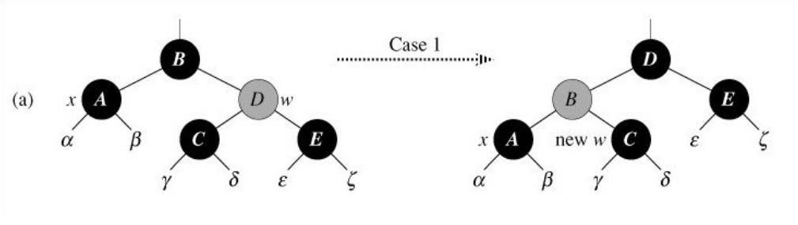
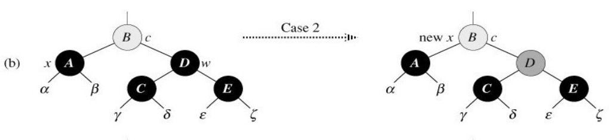
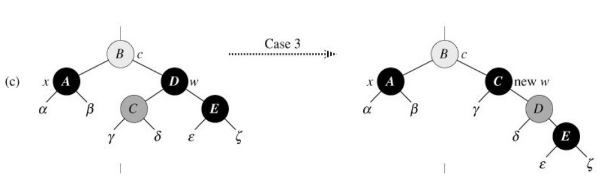
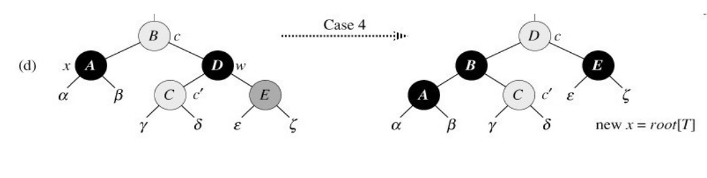

红黑树
==================================================================
一种自平衡(self-balancing)二叉树，能在O(logn)时间复杂度内实现插入、搜索、删除等操作。

性质
----------------------------------------------------------
二叉树的插入、搜索、删除、最大值、最小值等操作，时间复杂度均为O(h)，h为树的高度。红黑树的以下性质保证了红黑树的高度为O(logn)级别，不会退化为链表，n为树中结点的数量：

1. 所有结点，要么是黑色的，要么是红色的。
2. 根结点永远是黑色的。
3. 用一个NIL结点，替代NULL指针，表示树到底了。NIL结点颜色永远为黑色。
4. 相邻的两个结点不能都为红色(红色结点的子结点不能是红色)。
5. 从根结点到叶子结点的每条路径上，黑色结点的数量都相等。

有时还有

与AVL树的对比
----------------------------------------------------------
AVL树比红黑树更平衡，但是插入、删除时的旋转操作更多。因此，如果你的程序需要做很多插入、删除操作，红黑树更好；如果插入、删除不是很频繁，但查询很频繁，那么AVL树更好。

插入
----------------------------------------------------------
新插入的结点颜色均为红色，若其父结点也为红色，那么需要进行一系列旋转操作，使得红黑树恢复性质。思路：要么把祖父结点的黑色向下转移；要么通过旋转，把父结点旋转上去，并涂黑，替代原来的祖父结点。

根据新结点的叔叔结点(父结点的兄弟结点)的颜色以及新结点的位置，可以分为3种情况。

1 叔叔结点为红色
~~~~~~~~~~~~~~~~~~~~~~~~~~~~~~~~~~~~~~~~~~~~~~~~~~~~~

.. image:: images/insert_case1.png
   :align: center

2 叔叔结点为黑色，新结点是其父节点的左孩子
~~~~~~~~~~~~~~~~~~~~~~~~~~~~~~~~~~~~~~~~~~~~~~~~~~~~~

.. image:: images/insert_case2.png
   :align: center

3 叔叔结点为黑色，新结点是其父节点的右孩子
~~~~~~~~~~~~~~~~~~~~~~~~~~~~~~~~~~~~~~~~~~~~~~~~~~~~~
旋转一次，转化为第2种情况。

.. image:: images/insert_case3.png
   :align: center

删除
----------------------------------------------------------
考虑一下普通二叉搜索树的删除：当要删除结点z为叶子结点时，直接删除；当z只有一个孩子时(此时令y为z自己)，用它的子结点x替代它自己；当有两个孩子时，找出该结点的后继结点y，把y中所有数据复制到z中，转而删除y，y必定只有一个子结点x或没有子结点(即x为NIL结点)，用x替代y即可。

为什么需要修复呢？当x与y同为黑色时，用x去替代y，就减少了一个黑色结点。修复过程可以理解为，我们试图在x上涂上黑色，但x已经是黑色了，我们得采取其他办法，令经过x的路径上，黑色结点增加1个，又不影响x的兄弟那一分支才行。

思路：我们可以在此分支上增加一个黑色结点；或者在另一个分支上减少一个黑色结点，并在两个分支共同的父结点上涂上黑色。

删除时主要看要删除结点x的兄弟w，及其子结点。

1 兄弟结点w为红色
~~~~~~~~~~~~~~~~~~~~~~~~~~~~~~~~~~~~~~~~~~~~~~~~~~~~~
这种情况无法直接处理，我们只能处理w也为黑色的情况。因为w为红色，红黑树结点不能有连续的红色，因此w的子结点必定为黑色，可以通过旋转，让w的子结点成为x的兄弟，转换成其他情况。

2 w为黑，且w两个孩子都为黑
~~~~~~~~~~~~~~~~~~~~~~~~~~~~~~~~~~~~~~~~~~~~~~~~~~~~~
可以直接处理。我们将w上的黑色去掉，变为红色，那么x和w子树上都减少了1个黑色结点。然后，我们试图在x和w的父结点上涂上黑色，开始下一轮循环。parent(x)就是新的x。

3 w为黑，w的左孩子为红，右孩子为黑
~~~~~~~~~~~~~~~~~~~~~~~~~~~~~~~~~~~~~~~~~~~~~~~~~~~~~
无法直接处理，需利用旋转，使x的兄弟结点的右孩子为红色才行。

如图，将w右旋后，产生了x的新的w(兄弟结点)，此时w的右孩子为红色，问题转化为第4种情况。

4 w为黑，w的左孩子为黑，右孩子为红
~~~~~~~~~~~~~~~~~~~~~~~~~~~~~~~~~~~~~~~~~~~~~~~~~~~~~
可以直接处理。通过旋转，令x的上面多一个结点，并涂成黑色。

现在你知道为什么w右孩子为红，就可以直接处理了。因为这样就可以将其右孩子涂为黑色，保持w这边的黑结点数量不变。
