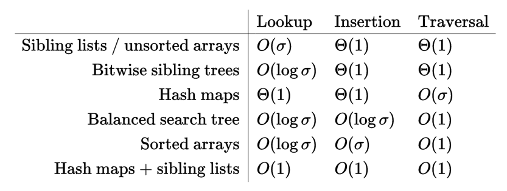

Suffix Tree后缀树
====================
suffix tree后缀树也称为PAT tree，是一种压缩过的trie，包含给定字符串的所有后缀。

定义
====================
长度为n的字符串S的后缀树是满足下列条件的树：

- 树有从1到n，总共n个叶子结点
- 除了根结点，每个内部结点至少有2个子节点
- 每条边都由S的一个非空子字符串标记
- 从一个结点出发的两条边的首字母不能相同（否则就不知道下一步该往哪里前进）
- 从根结点到叶子节点i，所有边上的字符串拼接起来后，是S的一个后缀S[i..n]。

后缀树还引入了结束标记$，来表示一个后缀的结束，这保证了任何一个后缀都不是另一个后缀的前缀。

Generalized suffix tree
===============================
Generalized suffix tree是由一个字符串集合构造出来的suffix tree。

功能
===============================
由长度为n的字符串S，或者总长度为n的字符串集合D = {S1, S2,..., Sk}构造出来的后缀树，有以下功能：

搜索字符串
--------------------

- 用O(m)的时间复杂度，检查一个长度为m的字符串P是否是S的子字符串。
- 用O(m)的时间复杂度，对于总长度为m的多个模式P1, P2,...,Pq，找出它们在D中第一次出现(作为子字符串)的位置。
- 用O(m+z)的时间复杂度，对于总长度为m的多个模式P1, P2,...,Pq，找出它们在D中的所有出现(共z次)的位置。
- 用小于线性的时间复杂度，找出正则表达式P。
- 对于模式P的每一个后缀，用O(m)的时间复杂度，找出最长的P[i..m]的长度，使其与D中的一个子字符串匹配。

找出字符串的属性
--------------------

- 用O(ni + nj)的时间复杂度，找出两个字符串Si和Sj的最长公共子字符串(longest common substring)
- 用O(n + z)的时间复杂度，找出所有的maximal pairs, maximal repeats or supermaximal repeats
- 用O(n)的复杂度找出Lempel–Ziv decomposition
- 用O(n)的复杂度找出最长重复子字符串(longest repeated substrings)
- 给定一个最小长度，用O(n)的复杂度找出最频繁出现的子字符串
- 找出Alphabet所允许的最短的字符串，要求其不在D中出现。
- 用O(n)的复杂度，找出最短的、只出现一次的子字符串
- 用O(n)的复杂度，对于每个i，找出Si的最短子字符串，要求其不在D中的其它字符串里出现

应用
===============================

- 字符串搜索：用O(n)时间来构建后缀树，再用O(m)的时间来搜索，m为要搜索的字符串的长度
- 找出longest repeated substring
- 找出longest common substring
- 找出字符串中的longest palindrome

此外，后缀树还常用于DNA序列搜索；用于数据压缩（LZW算法的变种LZSS）；找出重复的数据

实现
===============================
实现时一个重要的选择是parent与child的关系。最常见的实现使用链表，每个节点有一个指向其第一个子节点的的指针child，另外有一个指向下一个兄弟节点的指针next(sibling lists)。其他的实现方法有哈希表，排序或未排序的数组(每次扩容2倍的动态数组)，平衡搜索树。我们关心以下操作的性能：

- 由一个给定的字符，找到相应的子节点
- 插入一个子节点
- 列出一个节点的所有子节点

下表中，σ表示Alphabet的大小

后缀树的边和结点里大量的信息，让后缀树变得相当昂贵，通常会花费源文本大小的10倍到20倍空间。后缀数组将这一数字降低到8倍(包括最常公共前缀数组longest common prefix array)。使用wchar_t(在我的系统上，实际上是int)可以将这一数字进一步降低。

并行构建
===============================
有很多算法，可以并行地构建后缀树，从而加快速度。

外部构建
===============================
因为后缀树所占空间比文本大很多，所以有时候需要磁盘来帮助构建后缀树。在DNA模式识别中，有TDD、TRELLIS方法。

后缀树/后缀数组/Trie的对比
===============================
The TRIE was the first data structure of this kind discovered.

The suffix tree is a improvement over the TRIE ( it has suffix links which allow linear error search, the suffix tree trims unnecessary branches of the TRIE therefore it does not require as much space ).

The suffix array is a stripped down data structure based on the suffix tree (no suffix links (slow error matches), yet pattern matching is very fast).

The TRIE is not for real world use because it consumes too much space.

The suffix tree is lighter and faster than the Trie and is used to index ADN or optimize some large web search engines.

The suffix array is slower in some pattern searches than the suffix tree but uses less space, and is more widely used than the Suffix tree.

In the same family of data structures:

There are other implementations, the CST(Compressed Suffix Tree) is a implementation of the Suffix tree using a suffix array and some additional data structures to get some of the Suffix tree search capabilities.

The FCST(Fully Compressed Suffix Tree) takes it further, it implements a sampled suffix tree with a suffix array.

The DFCST is a dynamic version of the FCST.

Expanding:

The two important factors are space use and operation execution time. You might think that with modern day machines this is not relevant but to index the DNA of a single human being you would require 40 gigabytes of memory (using a uncompressed and unoptimized suffix tree). And to build one of this indexes over this much data can take days. Imagine Google, it has lots of searchable data, they need a large index over all web data and they do not change it every time someone builds a web page. They have some form of caching for that. However the main index is probably static. And every couple of weeks or so they gather all new web sites and data and build a new index, replacing the old when the new is finished. I do not know which algorithm they use to index, but it is probably a suffix array with suffix tree properties over a partitioned database.

The CST uses 8 gigabytes, however the suffix tree operations speed are heavily reduced.

The Suffix array can do the same in some 700 megas to 2 Gigas. However you will not find genetic errors in the DNA with a suffix array (meaning: searching for a pattern with a wildcard is much much slower).

The FCST (fully compressed suffix tree) can create a suffix tree in 800 to 1.5 gigas. With a rather small speed deterioration towards the CST.

The DFCST(dynamic fully compressed suffix tree) uses 20% more space than the FCST, and loses speed to the static implementation of the FCST. (however a dynamic index is very important)

There are not many viable (space wise) implementations of the suffix tree because it is very hard to make the operations speed boost compensate the data structures ram space cost.

This said the suffix tree has very interesting search results for pattern matching with errors. The aho corasick is not as fast (though nearly as fast for some operatons, not error matching) and the boyer moore is left in the dust.

Ukkonen算法
====================
Ukkonen算法是第一个可以在线性时间内构建后缀树的在线算法（即算法按照数据输入顺序来处理的算法，一开始并不需要所有数据都准备好）。
