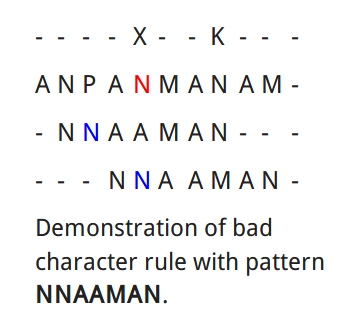
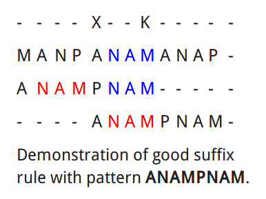

问题描述
=====================
有文本txt[0..n-1]和模式pat[0..m-1]，写一个函数search(char pat[], char txt[])，打印出pat在txt中的所有匹配。假定n > m。示例::

    Input:  txt[] = "THIS IS A TEST TEXT"
            pat[] = "TEST"
    Output: Pattern found at index 10

    Input:  txt[] =  "AABAACAADAABAABA"
            pat[] =  "AABA"
    Output: Pattern found at index 0
            Pattern found at index 9
            Pattern found at index 12

各算法的性能
====================

+---------------------------------------------------------------+-----------------------+---------------------------------------+
| Algorithm							| Preprocessing time 	| Matching time				|
+===============================================================+=======================+=======================================+
| Naïve string search algorithm					| 0			| Θ(nm)					|
+---------------------------------------------------------------+-----------------------+---------------------------------------+
| Rabin–Karp string search algorithm				| Θ(m)			| average Θ(n + m),  worst Θ((n−m)m)	|
+---------------------------------------------------------------+-----------------------+---------------------------------------+
| Finite-state automaton based search				| Θ(mk)			| Θ(n)					|
+---------------------------------------------------------------+-----------------------+---------------------------------------+
| Knuth–Morris–Pratt algorithm(KMP)				| Θ(m)			| Θ(n)					|
+---------------------------------------------------------------+-----------------------+---------------------------------------+
| Boyer–Moore string search algorithm				| Θ(m + k)		| best Ω(n/m),  worst O(mn)		|
+---------------------------------------------------------------+-----------------------+---------------------------------------+
| Bitap algorithm (shift-or, shift-and, Baeza–Yates–Gonnet)	| Θ(m + k)		| O(mn)					|
+---------------------------------------------------------------+-----------------------+---------------------------------------+
| Two-way string-matching algorithm				| Θ(m)			| O(n+m)				|
+---------------------------------------------------------------+-----------------------+---------------------------------------+
| BNDM (Backward Non-Deterministic Dawg Matching)		| O(m)			| O(n)					|
+---------------------------------------------------------------+-----------------------+---------------------------------------+
| BOM (Backward Oracle Matching)				| O(m)			| O(n)					|
+---------------------------------------------------------------+-----------------------+---------------------------------------+

1 暴力解法Naive string search algorithm
====================================================
O(n^2)。从txt的每一个字符开始，跟pat进行匹配::

    for m in txt[0..n-1]
        从m开始，与pat中的字符逐个比较

最好情况
************
pat的第一个字符在txt中不存在
+++++++++++++++++++++++++++++++++++++
O(n)::

    txt[] = "AABCCAADDEE"
    pat[] = "FAA"

最坏情况
**************
txt和pat中所有字符都相等
+++++++++++++++++++++++++++++++
O(n^2)::

    txt[] = "AAAAAAAAAAAAAAAAAA"
    pat[] = "AAAAA"

只有最后一个字符不相等
++++++++++++++++++++++++++++++
O(n^2)::

    txt[] = "AAAAAAAAAAAAAAAAAB"
    pat[] = "AAAAB"

2 KMP算法
=====================
演示
--------------
思想：当我们遇到不匹配时，就已经扫描过接下来的一些字符了。可以利用这些信息，来跳过一些字符，避免不必要的重复计算。

让我们用一个实例来演示这个算法。在任意给定时间，本算法被两个整数m和i所决定：

- m 代表主文字符串S内匹配字符串W的当前查找位置，
- i 代表匹配字符串W当前做比较的字符位置。
- S 字符串
- W 要匹配的模式

图示如下::

                 1         2  
    m: 01234567890123456789012
    S: ABC ABCDAB ABCDABCDABDE
    W: ABCDABD
    i: 0123456

我们从W与S的开头比较起。我们比对到S[3](=' ')时，发现W[3](='D')与其不符。接着并不是从S[1]比较下去。我们已经知道S[1]~S[3]不与W[0]相合。因此，略过这些字元，令m = 4以及i = 0::

                 1         2  
    m: 01234567890123456789012
    S: ABC ABCDAB ABCDABCDABDE
    W:     ABCDABD
    i:     0123456

如上所示，我们检核了"ABCDAB"这个字串。然而，这与目标仍有些差异。我们可以注意到，"AB"在字串头尾处出现了两次。这意味着尾端的"AB"可以作为下次比较的起始点。因此，我们令m = 8, i = 2，继续比较。图示如下::

                 1         2  
    m: 01234567890123456789012
    S: ABC ABCDAB ABCDABCDABDE
    W:         ABCDABD
    i:         0123456

这就是KMP算法的全部思想，利用模式W的特征，决定下一次比较应该从哪里开始。在不错过任何潜在匹配的情况下，我们"预搜索"这个模式串本身并将其译成一个包含所有可能失配的位置对应可以绕过最多无效字符的列表。那么，该如何计算下一步比较开始的位置呢？我们引入几个概念:

“部分匹配”表
----------------
适当前缀：字符串除其本身以外的所有前缀都是其适当前缀。ABC的适当前缀是"", "A", "AB"。

适当后缀：字符串除其本身以外的所有后缀都是其适当后缀。ABC的适当后缀是"", "C", "BC"。

部分匹配表T：T[i]表示，W[0..i-1]的最长的适当后缀的长度，且这个后缀必须是W的前缀。

模式"participate in parachute"的部分匹配表::

	i		00 	01 	02 	03 	04 	05 	06 	07 	08 	09 	10 	11 	12 	13 	14 	15 	16 	17 	18 	19 	20 	21 	22 	23
	W[i] 	P 	A 	R 	T 	I 	C 	I 	P 	A 	T 	E 		I 	N 		P 	A 	R 	A 	C 	H 	U 	T 	E
	T[i] 	-1 	0 	0 	0 	0 	0 	0 	0 	1 	2 	0 	0 	0 	0 	0 	0 	1 	2 	3 	0 	0 	0 	0 	0

观察后可以发现，部分匹配中的数字在某种程度上是连续的。比如T[8] == 1，因为W[7] == W[0]；T[9] == T[8] + 1，因为W[8] == W[1]。可见如果W[i] == W[T[i]]，那么T[i+1] == T[i] + 1(例如i==8的情况)。
如果W[i] != W[T[i]]呢？这说明已经无法找到更长的适当后缀（同时也是前缀），只好看看有没有短一些的，反映到代码里就是let cnd ← T[cnd]。

以下是伪代码::

	algorithm kmp_table:
		input:
			an array of characters, W (the word to be analyzed)
			an array of integers, T (the table to be filled)
		output:
       		nothing (but during operation, it populates the table)

	    define variables:
    	    an integer, pos ← 2 (the current position we are computing in T)
    	    an integer, cnd ← 0 (the zero-based index in W of the next character of the current candidate substring)

	    (the first few values are fixed but different from what the algorithm might suggest)
    	let T[0] ← -1, T[1] ← 0

	    while pos < length(W) do
	        (first case: the substring continues)
	        if W[pos-1] = W[cnd] then
	            let T[pos] ← cnd + 1, cnd ← cnd + 1, pos ← pos + 1

	        (second case: it doesn't, but we can fall back)
	        else if cnd > 0 then
	            let cnd ← T[cnd]

	        (third case: we have run out of candidates.  Note cnd = 0)
        	else
            	let T[pos] ← 0, pos ← pos + 1

搜索算法
---------------
如果字符串和模式的字符匹配，就继续对比下一个字符；如果不匹配，就利用部分匹配表中的值，跳到下一个位置。

3 Rabin–Karp算法
=====================
设模式W的长度为m，对字符串S中的所有长度为m的子字符串进行hash，并将hash值与模式W的hash值对比。如果两者相等，才有比较两者的必要。关键在于，设计一种快速的hash算法，使得不必每次都扫描整个子字符串，就能生成hash值（否则就变成了暴力匹配法）。一般要求是，可以根据上一个子字符串的hash值，来算出下一个hash值。伪代码::

	function RabinKarp(string s[1..n], string pattern[1..m])
		hpattern := hash(pattern[1..m]);
		for i from 1 to n-m+1
			hs := hash(s[i..i+m-1])
			if hs = hpattern
				if s[i..i+m-1] = pattern[1..m]
					return i
		return not found

hash算法。这个hash算法叫做Rabin fingerprint，其公式为f(x) = m[0] + m[1] * x + ... + m[n-1] * x^n-1::

	// ASCII a = 97, b = 98, r = 114. 
	hash("abr") = (97 × 101^2) + (98 × 101^1) + (114 × 101^0) = 999,509 

	//             base   old hash    old 'a'         new 'a'
	// 因为br的位置向左移了一位，因此需要乘以101^1
	hash("bra") = [101^1 × (999,509 - (97 × 101^2))] + (97 × 101^0) = 1,011,309

这个算法在普通情况下运行时间为O(n+m)，然而最坏情况下的优先级为O(nm)。对于查找单个模式，不如KMP等算法好，但它很适合在文本中查找多个模式。查找多个模式时，分别计算出每个模式的hash值，然后和子字符串的hash值对比，其余的照旧。

4 有限自动机
==================
有限自动机，编译原理词法分析里用到过。它根据下一个字符，跳转到不同的状态去。

- 开始状态：自动机开始时所处的状态
- 接受状态（accept state）：当穷尽了所有的输入时，如果自动机停在一个接受状态，则自动机接受该输入(在本例中是字符串)，否则视为拒绝该输入。

以下是模式ACACAGA的自动机：

.. image:: images/FiniteAutomata.png

写成表格:

+-------+---+---+---+---+
| state | A | C | G | T |
+=======+===+===+===+===+
| 0	| 1 | 0 | 0 | 0 |
+-------+---+---+---+---+
| 1	| 1 | 2 | 0 | 0 |
+-------+---+---+---+---+
| 2	| 3 | 0 | 0 | 0 |
+-------+---+---+---+---+
| 3	| 1 | 4 | 0 | 0 |
+-------+---+---+---+---+
| 4	| 5 | 0 | 0 | 0 |
+-------+---+---+---+---+
| 5	| 1 | 4 | 6 | 0 |
+-------+---+---+---+---+
| 6	| 7 | 0 | 0 | 0 |
+-------+---+---+---+---+
| 7	| 1 | 2 | 0 | 0 |
+-------+---+---+---+---+

那么如何构建自动机呢？一种方法是，将模式(pattern)视为没有元字符的正则表达式，先对模式进行语法分析，然后转换为NFA，再转换为DFA（可选），然后用自动机进行匹配。Geeksforgeeks网站上提供了2种构造方式，已存入repo。

5 Boyer–Moore string search algorithm
=============================================
定义
-------------

- 问题中所有可能出现的字符集合，称为Alphabet
- S[i]：S的第i个字符，i从1开始算起
- S[i..j]：从S[i]到S[j]（含）的子字符串
- 前缀：子字符串S[1..i]，i属于[1, n]，n为字符串S的长度
- 后缀：子字符串S[i..n]，i属于[1, n]
- 要被搜索的模式为P，长度为n。
- 要从中搜索的文本为T，长度为m。
- P与T的对齐，是用k表示的，它表示P的最后一个字符与T的第k个字符对齐。
- 当P与T[(k-n+1)..k]相等时，我们就说找到了一个匹配

Boyer–Moore算法使用预处理P得到的信息，来跳过尽可能多的字符。算法从k=n开始，这样P的最左端就与T的最左端对齐。从P的最后一个字符开始往前，依次与T中相应的字符对比。如果某字符不匹配，则使用坏字符、好后缀规则，跳过尽可能多字符：

坏字符规则
+++++++++++++++++
对任意一种P与T的对齐(任意一个k)，从右向左匹配。当我们遇到一个不匹配字符时，比如下图中红色的N，在P中向左找到最近的N，并将其对其到T中的红色N下面。如果P找不到这样一个字符，则将P的左端移动到红色N的右边一位去（因为N在P中根本不存在，不论将P中的哪个字符与其对比，都绝不会匹配）。

坏字符规则有两个版本：原始版本和扩展版本。

在原始版本中，用一个长度为AlphabetSize的数组(如果问题中只出现ASCII码，那么AlphabetSize的大小就是256)，只记录每一个字符在P中最后一次出现的位置。这时，如果“坏字符”出现在已匹配部分的右边，那么就对我们没有任何帮助，我们不能把P向左移。

在扩展版本中，用一个二维数组(或者数组+链表？)，第一个下标是坏字符本身，第二个下标是当前对比到的位置i，以便我们在知道坏字符和当前位置的情况下，可以迅速向左找到距离最近的那个“坏字符”。但如果用二维数组，数组的空间就从AlphabetSize，变成了AlphabetSize * n。于是，有人提出了数组+链表的方式，用链表记录每个字符的所有出现位置，当出现“坏字符”时，就按顺序可以找出P中当前位置左边最近的一个“坏字符”。但是最坏情况下，这个改动会让算法的运行时间翻倍。不过在大多数情况下，算法增加的时间远远不到两倍。而且，我们可以用二分查找法来保证运行速度。

好后缀规则
+++++++++++++++++
设对某一种P与T的对齐(任意一个k)，T的子字符串t与P的后缀匹配，但这时t的左边出现了一个不匹配的字符。这时，在P中向左寻找最近的一个子字符串t'，使t' = t，但t'的左边那个字符与t左边的不同，且t'不是P的后缀(即t'必须在t的左边)，然后向右移动P，把t'移动到原来t所在的位置(只有这样才可能产生匹配)。如果t'不存在，则将P移动最小距离，使得移动后的P超过t的左端，且P的一个前缀与t的一个后缀匹配。如果没有能满足条件的移动，则将P向右移动n个位置。如果T中找到了P，则将P向右移动最小距离，使得P的一个适当前缀与T中的P的后缀匹配(类似kmp)。如果没有能满足条件的移动，则将P向右移动n个位置，使P越过t。

Galil发则
++++++++++++++++
假设有一个对齐k1，P与T一直对比到T的字符c。然后P跳转到k2，它的左端在c与k1之间，那么在下一次比较阶段，P的一个前缀必定与T[(k2-n)..k1]匹配。因此，如果对比进行到了T的k1位置，不需要显式地比较k1后面的字符，就能找到P的一次出现。这个优化方法，可以让算法在最差情况下以线性运行级别执行。
