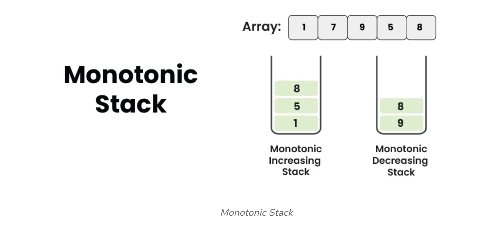

# Monotonic Stack
A Monotonic Stack is a common data structure in computer science that maintains its elements in a specific order. Unlike traditional stacks, Monotonic Stacks ensure that elements inside the stack are arranged in an increasing or decreasing order based on their arrival time. 



Monotonic Stacks can be broadly classified into two types:

1. Monotonic Increasing Stack
2. Monotonic Decreasing Stack

## Monotonic Increasing Stack
A **Monotonically Increasing Stack** is a stack where elements are placed in **increasing** order **from the bottom to the top**. Each new element added to the stack is **greater than or equal to** the one below it. If a new element is smaller, we remove elements from the top of the stack until we find one that is smaller or equal to the new element, or until the stack is empty. This ensures that the stack always stays in increasing order.

单调递增栈，即元素**从栈底到栈顶保持递增**的栈。每个即将入栈的元素，都必须**大于或等于栈顶元素**。如果条件不满足，那就必须持续退栈，直到即将入栈的元素大于或等于栈顶元素为止（或直到栈为空）。

## Monotonic Decreasing Stack
A **Monotonically Decreasing Stack** is a stack where elements are placed in **decreasing** order **from the bottom to the top**. Each new element added to the stack must be **smaller than or equal to** the one below it. If a new element is greater than top of stack then we remove elements from the top of the stack until we find one that is greater or equal to the new element, or until the stack is empty. This ensures that the stack always stays in decreasing order.

单调递减栈，即元素**从栈底到栈顶保持递减**的栈。每个即将入栈的元素，都必须**小于或等于栈顶元素**。如果条件不满足，那就必须持续退栈，直到即将入栈的元素小于或等于栈顶元素为止（或直到栈为空）。

## 用途
以下是Next Greater Element的写法：

```java
Stack<Integer> stack = new Stack<>();
for (int num : arr) {
    while (!stack.isEmpty() && num > stack.peek()) {
        // num in on the right side of elem, and num > elem
        // thus num is the Next Greater Element of elem
        int elem = stack.pop();
    }
    stack.push(num);
}
// Elements still in the stack don't have Next Smaller Element
```

以下是Previous Greater Element的写法：

```java
Stack<Integer> stack = new Stack<>();
for (int num : arr) {
    while (!stack.isEmpty() && num >= stack.peek()) {
        int elem = stack.pop();
    }
    // 
    stack.push(num);
}
// Elements still in the stack don't have Next Smaller Element
```

没必要记复杂的规则，只要按以下原则就可以：

* Next Greater Element: 要得到Next Greater Element，就要把元素保留在栈里，直到遇到**比栈顶大**的新元素。这个新元素就是这些弹出元素的Next Greater Element
* Next Smaller Element: 要得到Next Smaller Element，就要把元素保留在栈里，直到遇到**比栈顶小**的新元素。这个新元素就是这些弹出元素的Next Smaller Element
* Previous Greater Element: 把栈里比新元素小的都弹出，留下的都是比新元素大的，新的栈顶就是Previous Greater Element
* Previous Smaller Element: 把栈里比新元素大的都弹出，留下的都是比新元素小的，新的栈顶就是Previous Greater Element

## Leetcode Problems

* 901. Online Stock Span: Previous Greater Element
* 496. Next Greater Element I
* 503. Next Greater Element II
