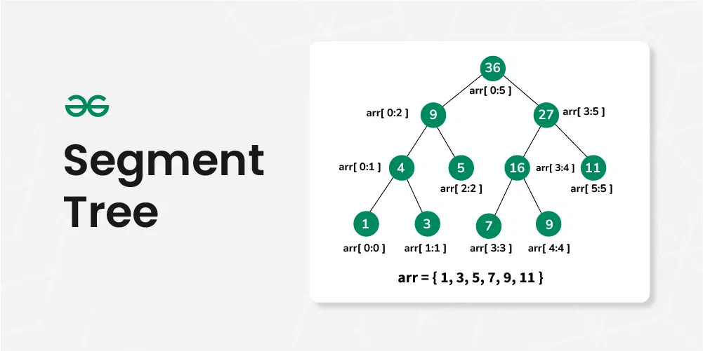
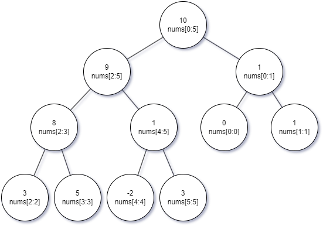

# Segment Tree
Segment Tree is a data structures that allows efficient querying and updating of intervals or segments of an array.



* It is particularly useful for problems involving range queries, such as finding the sum, minimum, maximum, or any other operation over a specific range of elements in an array.
* The tree can either be built recursively or iteratively. Recursive approach needs an array of size 4 * N, while iterative one only needs 2 * N.
* This structure enables fast query and update operations with a time complexity of O(log n), making it a powerful tool in algorithm design and optimization.

## Basic structure of the tree
Given an array nums=[0, 1, 3, 5, -2, 3] and its length is N, suppose we're using segment tree to calculate range sums.

* Each non-leaf node represents the sum of a range in the array.
* The root node represents the sum of range [0, N-1], aka all the elements.
* Each leaf node represents a single element, aka nums[i], 0 <= i < N.

## Iterative vs Recursive
There're 2 ways of building the segment tree: iterative and recursive.

### Iterative
#### Build
Since there're N elements in nums, the final tree will have N leaf nodes. Since segment tree is a binary tree, there will be at most N-1 internal nodes. Together, there'll be at most 2*N-1 nodes. So it's safe to create a array `tree = int[2*N]` to represent the segment tree.

For clarity, we use 1-indexing. For any internal node tree[index], its left child will be tree[index*2] and right child will be tree[index*2+1]. For any node tree[index], its parent will be tree[index/2]. It's similar to binary heap.

With the above knowledge, we can start building the segment tree now.

First, we build the leaf nodes. We can simply place the leaf nodes, aka the original values of nums[], to the end of the tree[] array.

```
    for i := N; i < 2*N; i++ {
        st.tree[i] = nums[i - N]
    }
```

Then we calculate the internal nodes from bottom to top:

```
	for i := N - 1; i > 0; i-- {
        // For a sum segment tree, an internal node's value is the sum of both children
		st.tree[i] = st.tree[2*i] + st.tree[2*i+1]
	}
```

For nums = [0, 1, 3, 5, -2, 3], the segment tree will be like:



#### Query
To query the sum of a range [i, j], first we locate the corresponding tree nodes tree[i+N] and tree[j+N], then move upward.

For nums = [0, 1, 3, 5, -2, 3], N = 6, suppose we're querying the sum of range [0, 2], the corresponding leaf nodes are tree[left] = tree[6] = 0 and tree[right] = tree[8] = 3.

For each loop:

* If tree[left] is the right child of its parent, add it to result and exclude its parent from further calculation. This is because tree[left-1] isn't included in the range, which means the value of tree[parent] = tree[left/2] shouldn't be added to the result. Thus we should add only tree[left] to the result and exclude its parent from the result.
* If tree[right] is the left child of its parent, add it to result and exclude its parent from further calculation. This is because tree[right+1] isn't included in the range, which means the value of tree[parent] = tree[right/2] shouldn't be added to the result. Thus we should add only tree[right] to the result and exclude its parent from the result.
* Move upward: left /= 2, right /= 2.

Note: if tree[left] is the left child of its parent and left+1 < right, tree[left+1] must also be in the range. This means we can use their parent's value. So we can just move upward.

#### Update
Suppose we're updating nums[i] and the corresponding tree node is tree[index], index = i + N.

First we change the value of tree[index]. Then we add the same diff to its parent. Repeat until we reach 0.

### Recursive
