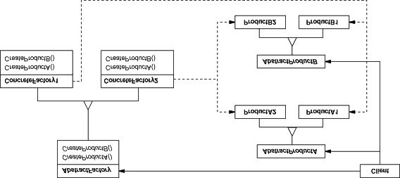
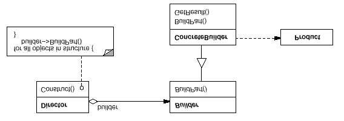
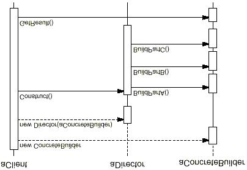
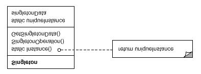

Creational Patterns
=========================================================
Creational Patterns创建型设计模式抽象了实例化的过程。class creational pattern(类创建型模式)使用继承改变被实例化的类；object creational pattern(对象创建型模式)将实例化委托给另一个对象。

随着系统演化得越来越依赖于对象复合而不是类的继承，创建型模式变得更为重要。在这些模式中，有两个不断出现的主旋律：

1. 它们都将关于该系统使用那些具体的类的信息封装起来。
2. 它们隐藏了这些类的实例是如何被创建和放在一起的。

因此，创建型模式在什么被创建，谁创建它，它是怎样被创建的，以及何时创建这些方面给予你很大的灵活性。

Abstract Factory
-----------------------------------------
我们需要生成以下类的实例：ProductA1和ProductA2(接口AbstractProductA)，ProductB1和ProductB2(接口AbstractProductB)。

naive方案：在任何需要这些实例的地方写::

    if (current_version == "1") {
        // create ProductA1 & ProductB1
    } else if (current_version == "2") {
        // create ProductA2 & Product B2
    }

缺点显而易见。如果后来又有了version3呢？万一我们需要调整所有Product实例的构造参数呢？我们将不得不修改所有创建Product的代码。

AbstractFactory模式见下图：

其中，ProductA1和ProductB1被称为一个family；ProductA2和ProductB2被视为一个family。

应用场景：

- a system should be independent of how its products are created, composed, and represented.
- a system should be configured with one of multiple families of products.
- a family of related product objects is designed to be used together, and you need to enforce this constraint.
- you want to provide a class library of products, and you want to reveal just their interfaces, not their implementations.

相关的类：

- AbstractFactory (WidgetFactory)：为创建抽象product实例的操作声明一个接口
- ConcreteFactory (MotifWidgetFactory, PMWidgetFactory)：实现用于创建实际product(即ProductA1/ProductA2等)实例的操作
- AbstractProduct (Window, ScrollBar)：为product类型的对象声明一个接口
- ConcreteProduct (MotifWindow, MotifScrollBar)：定义要被相应的ConcreteFactory创建的Product对象；实现AbstractProduct接口
- Client：仅使用AbstractFactory和AbstractProduct声明的接口

协作：

- 一般程序运行时只创建一个ConcreteFactory实例，它创建包含特定实现的product对象。要创建不同的product对象，client需要使用不同的ConcreteFactory
- AbstractFactory将product对象的创建拖延到了ConcreteFactory子类中

优点与缺点：

1. ConcreteProduct与client被隔离开。Factory类接管了product对象的创建，ConcreteProduct(MotifWindow, MotifScrollBar)被封装在ConcreteFactory里，client代码里完全不会出现。client只通过虚拟接口来操作实例。
2. 切换product family(从一个ConcreteProduct切换到另一个)变得容易。ConcreteFactory的类仅在其实例化时出现一次(只有一个实例)，要切换到另一个ConcreteProduct，只需改变ConcreteFactory，并重建product对象即可。
3. 实现了产品中的一致性。保证程序里只有同一个family的product对象(所有product对象都是同一个ConcreteFactory创建的，自然都属于同一个faimily)
4. 支持新类型的product是困难的。首先得扩展AbstractFactory，增加一个CreateProductC()接口，之后扩展所有ConcreteFactory，分别实现CreateProductC()方法。也就是，需要修改所有的Factory类。

实现：

1. Factory类应被实现为单例。对每个product family，程序一般只需要一个ConcreteFactory实例。
2. 

Builder
-----------------------------------------
将复杂对象的构建与其表现形式分开，以便同样的构建过程可以构建出不同的表现形式。例如，RTF文件的解析与格式转换功能(改变其表现形式)应当分离。

对于RTF阅读器，上图中的Director就是RTFReader本身，Builder是格式转换器的虚接口，ConcreteBuilder是实际将解析后的RTF内容转换成别的格式的类。

相关的类：

- Builder (TextConverter)：
    * 为Product对象的创建部分，提供抽象接口
- ConcreteBuilder (ASCIIConverter, TeXConverter, TextWidgetConverter)
    * 通过实现Builder的接口，构建并组装product的各部分
    * 定义并持续跟踪它创建的表现形式
    * 提供获取product的接口(GetASCIIText, GetTextWidget等)
- Director (RTFReader)
    * 调用Builder接口构建出对象
- Product (ASCIIText, TeXText, TextWidget)
    * 将被构件的对象表现出来。ConcreteBuilder构建product的内部表现形式，定义其组装过程。
    * includes classes that define the constituent parts, including interfaces for assembling the parts into the final result

协同：

- client创建Director对象，并用想要的Builder对象来配置它
- 每当需要构建product的一部分时，Director通知builder
- Builder处理Director的请求，添加product的组件
- client从builder获取到product

影响：

1. product的内部表现形式可以多种多样。Builder对象给Director提供了一个抽象接口，用于构建product，这就对client隐藏了product的表现形式、内部结构、组装方法。又与product是通过抽象接口构建的，要写一个新的builder，只需要改变product的内部表现形式即可。
2. 它将构建product和展现product的代码隔离开。
3. 给予对构建过程的更大控制权

Factory Method
-----------------------------------------
意图：定义一个创建对象的接口，但是让子类去决定要实例化哪一个类。Factory Method让类把实例化拖延到子类中。

Singleton
-----------------------------------------
意图：确保一个类只有一个实例，并提供一个全局的访问点。

应用场景：

- 一个类必须只有一个实例，并且必须能从client的任何地方访问
- 当单一的实例应当通过创建子类来扩展，且client应该能不修改代码就使用扩展后的实例时

结构：

相关的类：

- Singelton
    * 定义一个class方法Instance()，来让client可以访问这个独一无二的实例。
    * 或许负责创建这个独一无二的实例

协作：

- client只通过Singleton类的Instance()方法来访问这个独一无二的实例。

影响：

1. 由于client只能通过Instance()方法来访问该实例，因此我们可以实现严格的访问控制。
2. 不用创建全局变量，不会污染global namespace
3. 允许改良。我们很容易建立Singleton的子类，并配置程序使用这个扩展过的类
4. 允许可变的实例数量。所有访问都是通过Instance()方法的，因此我们可以很容易改变设计，允许特定数目的Singleton实例。
5. 当然也可以通过类方法(static function)来替代单一实例的功能，但不够灵活。static function不能为虚函数，因此不能通过创建子类来修改其行为；而且今后难以更改为允许多个实例的设计。

实现：

::

    class Singleton {
    public:
        static Singleton *Instance();
    protected:
        Singleton();
    private:
        static Singleton *_instance;
    };

    Singleton *Singleton::_instance = 0;
    Singleton *Singleton::Instance() {
        if (_instance = 0) {
            _instance = new Singleton;
        }
    }

Instance()方法使用懒惰初始化(Lazy initialization)，只在需要时才创建实例。注意Singleton的构造函数是protected的，因此试图手动new一个Singleton会报错。此外，_instance是一个指向Singleton的指针，因此也可以指向Singleton的派生类。

为何不用C++的global或static变量呢？原因如下：

- 无法保证只有一个实例会被创建
- 静态变量初始化时，创建Singleton实例所需的信息可能尚未齐全
- C++并未定义全局变量初始化的顺序，因此如果Singleton之间有依赖，就可能会失败。
- 不论是否使用Singleton实例，C++都会创建该实例，比起懒惰初始化，更耗费性能。

Singleton类的子类化：

如果Singleton有子类，如何判断是用它的子类，还是它自己呢？最简单的方法：在Instance()方法里判断，比如用环境变量。还可以将Singleton和它的子类写成模块，链接时选择需要的那个。还能使用注册系统(registry of singletons)，给每个Singleton注册一下，需要的时候取用。
