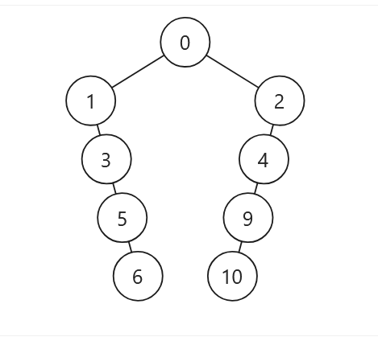

# 199. Binary Tree Right Side View
Given the root of a binary tree, imagine yourself standing on the right side of it, return the values of the nodes you can see ordered from top to bottom.

Example 1:

Input: root = [1,2,3,null,5,null,4]

Output: [1,3,4]

Explanation:

Example 2:

Input: root = [1,2,3,4,null,null,null,5]

Output: [1,3,4,5]

Explanation:

Example 3:

Input: root = [1,null,3]

Output: [1,3]

Example 4:

Input: root = []

Output: []

Example 5:

Input: root = [0,1,2,null,3,4,null,null,5,9,null,null,6,10,null]

Output: [0,2,4,9,10]

Constraints:

* The number of nodes in the tree is in the range [0, 100].
* -100 <= Node.val <= 100

## Solution
This problem is slightly different from what we saw before. In example 5, the nodes in the right subtree are considered to be on te right side of those in the left subtree. So we don't need to calculate the horizontal coordinates of each node. In DFS, if we visit right subtrees first, we'll get the correct result.
