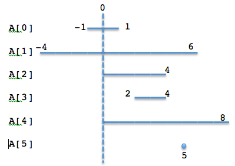
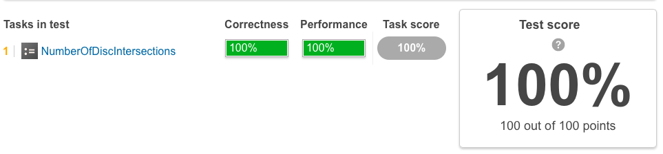
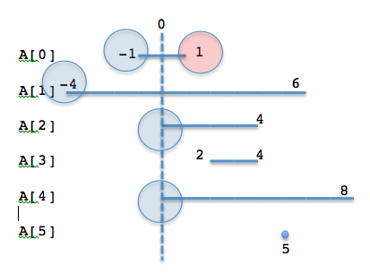
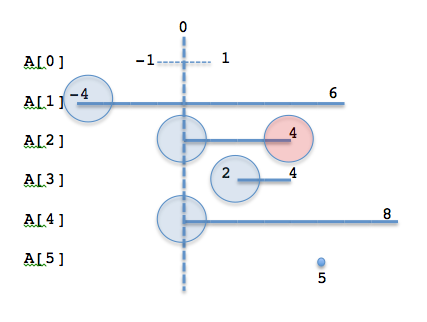
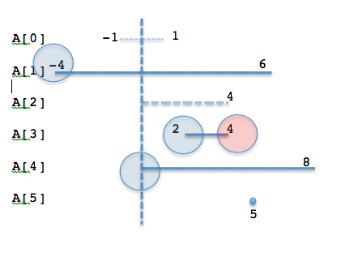
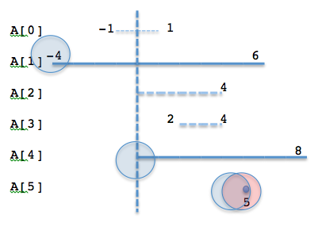
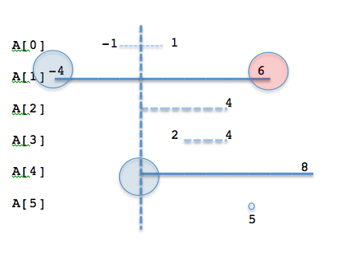
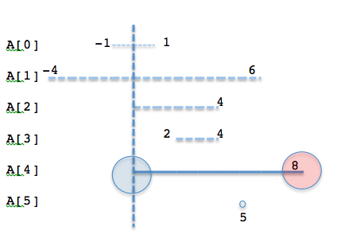
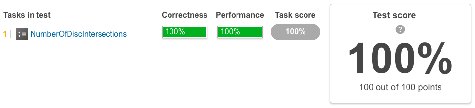

NumberOfDiscIntersections
===========================================================
Compute the number of intersections in a sequence of discs

Description
--------------------------------------------------
We say that the J-th disc and K-th disc intersect if J ≠ K and the J-th and K-th discs have at least one common point (assuming that the discs contain their borders).

The figure below shows discs drawn for N = 6 and A as follows:

-  A[0] = 1
-  A[1] = 5
-  A[2] = 2
-  A[3] = 1
-  A[4] = 4
-  A[5] = 0

.. image:: images/NumberOfDiscIntersections.png

There are eleven (unordered) pairs of discs that intersect, namely:

- discs 1 and 4 intersect, and both intersect with all the other discs;
- disc 2 also intersects with discs 0 and 3.

Write a function::

    int solution(vector<int> &A);

that, given an array A describing N discs as explained above, returns the number of (unordered) pairs of intersecting discs. The function should return −1 if the number of intersecting pairs exceeds 10,000,000.

Given array A shown above, the function should return 11, as explained above.

Assume that:

- N is an integer within the range [0..100,000];
- each element of array A is an integer within the range [0..2,147,483,647].

Complexity:

- expected worst-case time complexity is O(N*log(N));
- expected worst-case space complexity is O(N), beyond input storage (not counting the storage required for input arguments).

Elements of input arrays can be modified.

解答1：O(N^2)
--------------------------------------------------
给定两个以i和j为圆心的圆，那么其半径分别为A[i]和A[j]。由题目描述可知，若一个较大的圆包含另一个圆，那么两者也被认为是相交的。那么，什么条件下，两个圆是相交的呢？

显然，只有当两个圆的半径相加都不如i与j的距离大时，两个圆不相交，除此之外都是相交的。因此，下列条件满足时两圆相交::

    A[i] + A[j] >= j - i, i < j

上述条件可以改写为::

    A[i] + i >= j - A[j], i < j

尝试所有可能的i与j组合，遇到符合条件的就记入结果。

解答2：O(NlogN)
--------------------------------------------------
Let's think of this problem graphically. Here is a pictorial representation of the example data given in the solution.

One might notice this kind of a representation seems a bit like what we see in a compiler course. Indeed, we may have some impression that it is sort of a liveness analysis problem, as we seen in register allocation; consider each element of the array A is like a variable. To get how many registers are required for a program, we need to see what is the maximum number of variables that are alive simultaneously. If the actual number of the CPU's registers is not enough, one has to generate the code to escape some variables onto the memory at least temporarily.

So this problem is about liveness. Let's consider the left side of a disc is the beginning of liveness and the right side of a disc is the end of liveness.

Checking how many other discs are 'live' between this regions gives the number of the intersections the disc has with the other discs.

However, this time in this problem, we only need the number of intersections and do not need to enumerate all the combinations. We only have to check the number of the 'live' discs.

If we sort the left limits and right limits of the given discs, we only have to scan the array only once after that.

Here is the score of this approach, the detected time complexity is 'O(N * log(N)) or log(N)', since we have two qsort 'O(N * log(N))' and one for loop to scan the array 'O(N)' (so O(2 * N * log(N) + N), taking the bigger time complexity, it will be O(N * log(N)) ).

::

    #include <alloca.h>

    int compare(const void* a, const void *b)
    {
        long long l = *((long long*)a);
        long long r = *((long long*)b);

        if (l == r)
            return 0;
        return l < r ? -1 : 1;
    }

    int solution(int A[], int N) {
        int memsize = sizeof(long long) * N;
        long long* activate = (long long*)alloca(memsize);
        long long* deactivate = (long long*)alloca(memsize);

        long long i = 0;
        for (; i < N; i++){
            activate[i] = i - A[i];
            deactivate[i] = i + A[i];
        }

        qsort(activate, N, sizeof(long long), compare);
        qsort(deactivate, N, sizeof(long long), compare);

        long long total = 0;

        long long currentActive = 0;
        long long activatedIndex = 0;
        long long deactivatedIndex = 0;

        for (i = 0; i < N; i++){
            while (activatedIndex < N &&
                   activate[activatedIndex] <= deactivate[deactivatedIndex]) {
                activatedIndex++;
                currentActive++;
            }

            currentActive--;
            total += currentActive;
            if (total > 10000000)
                return -1;
            deactivatedIndex++;
        }

        return total;
    }

This approach may require some explanation to understand. Let's see what is done graphically. First, as shown in the code, both upper(right) limit and lower(left) limit are computed and sorted, but sorted in different arrays. We don't even pair these two values for each disc, as we don't have to enumerate the combinations of discs that intersect this time.

.. image:: images/3.png

The smallest number for the upper limit is 'one' as above. So let's focus on this number now. How many discs are 'live' before this A[0] disc 'dies'? It can be easily obtained by checking the lower limit numbers less than 'one'. As the lower limits are also sorted, we only have to slide the current index linearly to get the next smallest value.

Note that we don't need to know the value of a lower limit belong to which disc. What we are checking now is 'the smallest upper limit', which means all the other upper limit values are larger than it. Then, any disc with the lower limit value below 'the smallest upper limit' always has an intersection.

So four discs was 'activated' to live including A[0] itself. Considering this, the number of the active 'intersection' at 'one' is 3. And after A[0] is 'deactivated' to die, there are 3 discs still alive here. As we have checked A[0] already, we can now forget  about it.

Then let's focus, the next smallest upper limit (A[2] or A[3]. Both would result the same answer anyway).

Before reaching 'four' (A[2]), one more disc is activated at 'two' (A[3]). so the live discs when we are checking 'four' (A[2]) increases to 4. So the number of discs that intersects with this time is 3 (4 - 1, as we don't want to count the A[2] disc itself').

One may consider A[0] is still alive indeed, but we already have checked that the combination of A[0] and A[2] in the previous phase.
So lets' count up the number of the intersection we checked so far (3 in the first phase + 3 in this phase = 6, now).

Let's check A[3] now, as it has 'four' the next smallest number.

No new disc is activated in this phase, so as the number of the current live discs are three, the number of the new intersection at this point is 2. As we have seen in the previous phases, we don't have to check if A[0] or A[2] intersects with A[3], since they are already checked. We have checked 3 + 3 + 2 = 8 interactions.

Now let's look at 5 of A[5]. (Indeed, it may need to be emphasized we really don't have to know if this is A[5] or not. We just need to know 'how many discs are 'alive' at a certain upper limit point.)

Right when A[5] is activated to live, it is deactivated to die. So the number of the live discs before the death is 3, and the number of new intersections is 2. We have checked 3 + 3 + 2 + 2 = 10 interactions.

Now let's check the next smallest upper limit 'six' (of A[1]). We have two discs alive before 6, thus the number of new intersections is '1'. We have checked 3 + 3 + 2 + 2 + 1 = 11 interactions.

We reached the biggest upper limit value 'eight'. Only one disc is alive and thus there is no intersection. The final answer we have is 11.

I hope the above graphical representations help the understanding of the solution. It should also be noted again that what we just need was 'the number of the active discs' and so we only have to care about the 'activate' and 'deactivate' events and do not have to care about to which disc each event belong.

Considering this fact, there can be found a solution even better than this.

解答3：O(N)
--------------------------------------------------
I found this solution in the stack overflow.
http://stackoverflow.com/questions/4801242/algorithm-to-calculate-number-of-intersecting-discs

This solution is O(N) and does not require any sorting. It also gives 100% score.

To fully understand the solution, we begin from a less efficient solution.

As described in the above solution, note this again: what we are interested in the number of the intersections, and it is not required to enumerate the combinations.

So we care about the liveness; we checked how many discs are still alive when any of them dies.

Considering this, we can prepare two arrays similar as the solution we have seen already, but we use the array to contain the number of activation events and deactivation events at the index [i].

Scanning such arrays from the beginning, we can track how many discs are alive at the index [i] and how many dies there. When we found any disc dies at the index [i], we count up the number of intersection by the_number_of_the_current_active_discs - 1 (which is the number of the intersections between the dying discs and other active discs), and the decrement the number of the active discs as one dies. If two or more discs are dying at the index [i], we repeat the above until there is no more disc that dies at the index.

The code is as below::

    #include <memory.h>
    #include <alloca.h>
    
    int solution(int A[], int N) {
        int memsize = sizeof(int) * N;
        int* activated   = (int*)alloca(memsize);
        int* deactivated = (int*)alloca(memsize);
    
        memset(activated    , 0x00, memsize);
        memset(deactivated  , 0x00, memsize);
    
        int i;
        // counter the number of activation/deactivation at the index.
        for (i = 0; i < N; i++) {
            // if the lower limit is below 0, consider it as 0.
            // this won't affect the number of activated discs at the index.
            long long lower_lim = i - (long long)A[i];
            lower_lim = (lower_lim < 0) ? 0 : lower_lim;
            activated[lower_lim]++;
    
            // the same to the upper limit.
            long long upper_lim = i + (long long)A[i];
            upper_lim  = upper_lim > N - 1 ? N - 1 : upper_lim;
            deactivated[upper_lim]++;
        }
    
        // let's scan the activated/deactivated arrays.
        int total = 0;
        int active = 0;
        for (i = 0; i < N; i++){
            active += activated[i];
            if (active == 0 || deactivated[i] == 0)
                continue;
            // we have at least one deactivated disc at the index 'i'.
            while (deactivated[i] > 0) {
                // active - 1is the number of the new intersection.
                total += active - 1;
                if (total > 10000000)
                    return -1;
                // one disc is dead.
                // so decrement the number of active discs.
                active--;
                deactivated[i]--;
            }
        }
        return total;
    }

One might notice what we do is the internal while loop is indeed computing the sequence of numbers with common difference, which can be replaced by a simple formula; think of this, if there is a sequence such as [10, 9, 8, 7,...], we can compute its sum by Sn = n (a + l) / 2, where 'Sn' is the sum, 'n' is the number of terms, and 'a' and 'l' are the first term and the last term respectively.

Modifying the code above in this manner, the best solution can be given.

::

    #include <memory.h>
    #include <alloca.h>
    
    int solution(int A[], int N) {
        int memsize = sizeof(int) * N;
        int* activated   = (int*)alloca(memsize);
        int* deactivated = (int*)alloca(memsize);
    
        memset(activated,   0x00, memsize);
        memset(deactivated, 0x00, memsize);
    
        int i;
        // counter the number of activation/deactivation at the index.
        for (i = 0; i < N; i++) {
            // if the lower limit is below 0, consider it as 0.
            // this won't affect the number of activated discs at the index.
            long long lower_lim = i - (long long)A[i];
            lower_lim = (lower_lim < 0) ? 0 : lower_lim;
            activated[lower_lim]++;
    
            // the same to the upper limit.
            long long upper_lim = i + (long long)A[i];
            upper_lim  = (upper_lim > N - 1) ? N - 1 : upper_lim;
            deactivated[upper_lim]++;
        }
    
        // let's scan the activated/deactivated arrays.
        int total = 0;
        int active = 0;
        for (i = 0;  i < N; i++) {
            active += activated[i];
            if (active == 0 || deactivated[i] == 0)
                continue;
            // Sn = n * (a + l) / 2
            //      where   Sn  is the sum of the sequence 9, 8, 7, 6, 5 ...
            //              n   is the number of terms  (= deactivated[i])
            //              a   is the first term       (= active - 1)
            //              n   is the last term        (= active - deactivated[i])
            //
            // int sn = deactivated[i] * ( (active - 1) + (active - deactivated[i]) / 2
            int sn = deactivated[i] * (2 * active - 1 - deactivated[i]) / 2;
            total += sn;
            if (total > 10000000){
                return -1;
            }
            active -= deactivated[i];
        }
        return total;
    
    }

While this problem is very tough and interesting, I still don't have any idea when such a solution can be useful. When you do linear register allocation, you actually have to track each variables and the set of live variables so to decide which variable(s) should be escaped to memory when the number of registers are not enough...
